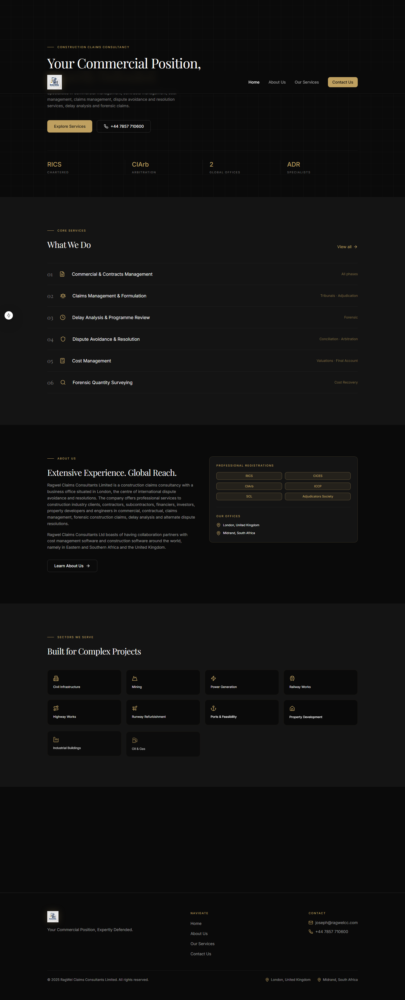
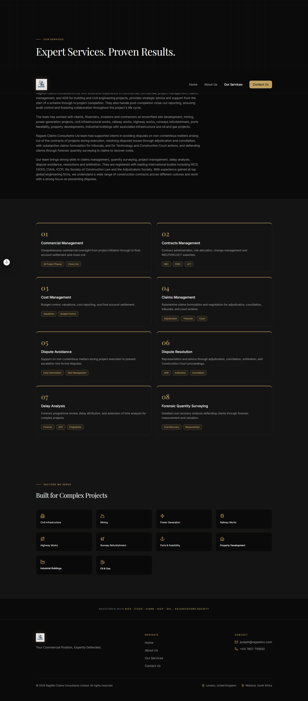
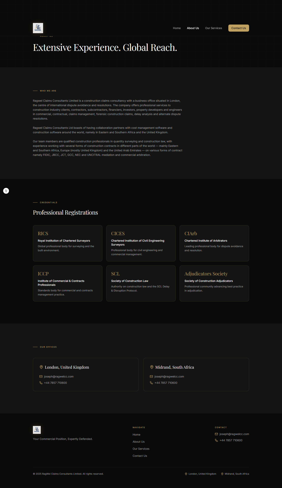
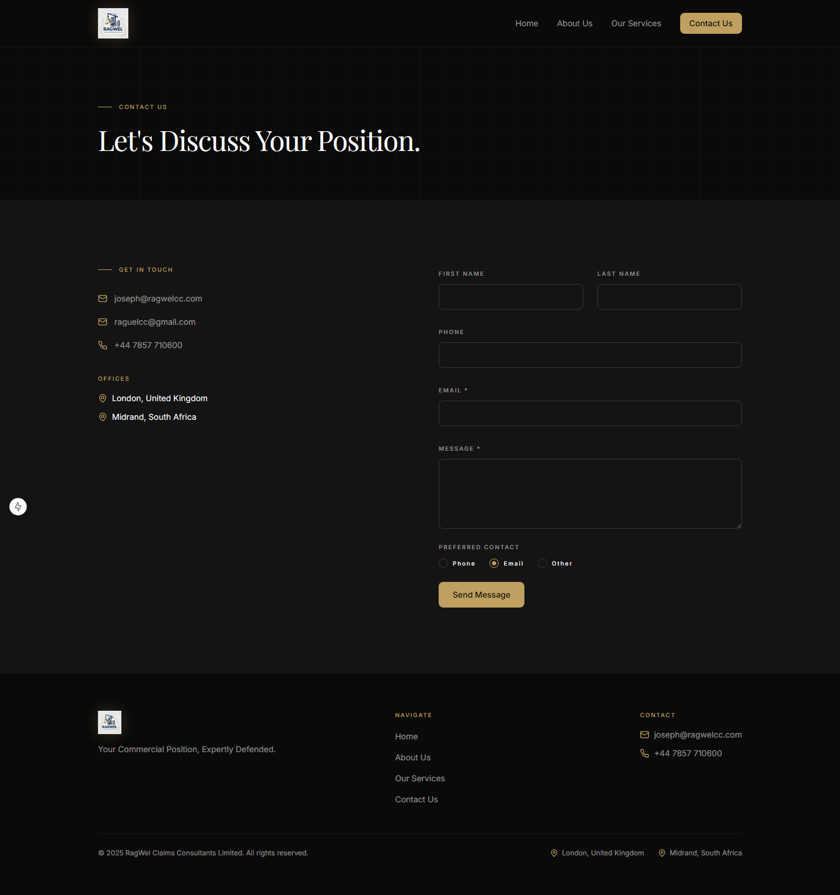
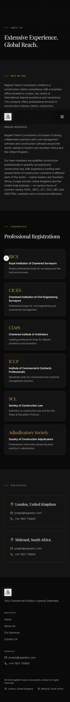

# Ragwel Claims Consultants Ltd. — Website

> **"Your Commercial Position, Expertly Defended."**

Premium, fully responsive marketing website for **Ragwel Claims Consultants Ltd.** — a construction claims consultancy with offices in London, UK and Midrand, South Africa.

---

## Screenshots

### Desktop

| Home | Services |
|------|----------|
|  |  |

| About | Contact |
|-------|---------|
|  |  |

### Mobile

| Home | About | Services | Contact |
|------|-------|----------|---------|
|  |  |  |  |

---

## Stack

| Layer | Technology |
|-------|-----------|
| Framework | Next.js 15 (App Router) |
| Language | TypeScript (strict) |
| Styling | Tailwind CSS v3 |
| Animation | Framer Motion |
| UI Components | shadcn/ui (Radix primitives) |
| Forms | React Hook Form + Zod |
| Icons | Lucide React |
| Fonts | Playfair Display + Inter (next/font/google) |

---

## Pages

| Route | Description |
|-------|-------------|
| `/` | Home — hero, services overview, about teaser, sectors, why Ragwel |
| `/about` | About Us — full company profile, credentials, offices |
| `/services` | Our Services — 8 service cards, sectors grid, credentials bar |
| `/contact` | Contact — details + enquiry form (Formspree / mailto fallback) |

---

## Getting Started

```bash
# 1. Install dependencies
npm install

# 2. Copy env file and add your Formspree ID (optional — see Contact Form below)
cp .env.example .env.local

# 3. Start dev server
npm run dev
# → http://localhost:3000
```

### Scripts

| Command | Description |
|---------|-------------|
| `npm run dev` | Start development server |
| `npm run build` | Production build |
| `npm run start` | Serve production build locally |
| `npm run lint` | Lint with eslint-config-next |

---

## Contact Form

The form on `/contact` works in two modes:

**Without Formspree** (default): submitting opens the user's email client pre-filled and addressed to `joseph@ragwelcc.com`.

**With Formspree** (recommended for production):
1. Create a free account at [formspree.io](https://formspree.io)
2. Create a new form and copy the form ID
3. Add to `.env.local`:
   ```
   NEXT_PUBLIC_FORMSPREE_ID=your_form_id_here
   ```
4. In the Formspree dashboard, add both `joseph@ragwelcc.com` and `raguelcc@gmail.com` as notification recipients

---

## Deployment (Vercel)

This project is deployed via [Vercel](https://vercel.com).

| Setting | Value |
|---------|-------|
| Production branch | `main` |
| Preview branch | `dev` |
| Build command | `npm run build` |
| Output directory | `.next` |
| Environment variable | `NEXT_PUBLIC_FORMSPREE_ID` |

### Steps
1. Import the `Sash3n/ragwel-website` repo in your Vercel dashboard
2. Set `NEXT_PUBLIC_FORMSPREE_ID` in Project Settings → Environment Variables
3. Every push to `main` auto-deploys to production
4. Every push to `dev` generates a preview URL

---

## Project Structure

```
app/
  layout.tsx              Root layout — fonts, JSON-LD, dark mode
  globals.css             CSS variables, grid texture, micro-label utilities
  page.tsx                Home page
  about/page.tsx
  services/page.tsx
  contact/page.tsx

components/
  layout/
    Navbar.tsx            Sticky nav, blur-on-scroll, mobile drawer
    Footer.tsx            3-column footer + bottom bar
    Logo.tsx              next/image logo wrapper
    PageShell.tsx         Shared chrome (nav + main + footer + toaster)
  sections/
    HeroSection.tsx       Above-fold hero — static render (no JS flash)
    ServicesOverview.tsx  Numbered service rows
    AboutTeaser.tsx       2-col about + credentials card
    SectorsGrid.tsx       10-sector icon grid
    WhyRagwel.tsx         3-column value props
    CredentialsBar.tsx    Full-width registration strip
    PageHero.tsx          Inner-page hero (About / Services / Contact)
  ui/                     shadcn primitives (Button, Card, Badge, etc.)
  ContactForm.tsx         RHF + Zod form with Formspree / mailto fallback

lib/
  constants.ts            All content — copy, nav, services, sectors, credentials
  animations.ts           Framer Motion variants
  metadata.ts             Per-page metadata + JSON-LD schema
  utils.ts                cn() Tailwind helper

public/
  images/
    ragwel-logo.webp      Brand logo
    screenshots/          README screenshots
```

---

## Git Workflow

```
main  ←── dev  ←── feature/*
```

- `main` — production only, mirrors Vercel live deployment
- `dev` — integration branch, Vercel preview deployments
- `feature/*` — one branch per feature, cut from `dev`

**Merge feature → dev:**
```bash
git checkout dev && git pull origin dev
git merge --no-ff --no-commit feature/<name>
git commit -m "merge: feature/<name> into dev"
git push origin dev
```

**Release dev → main:**
```bash
git checkout main && git pull origin main
git merge --no-ff dev -m "release: v<x.y.z> — <description>"
git tag -a v<x.y.z> -m "Release v<x.y.z>"
git push origin main --tags
```

---

## Contact

| | |
|-|--|
| Email | joseph@ragwelcc.com |
| Email | raguelcc@gmail.com |
| Phone | +44 7857 710600 |
| London | United Kingdom |
| Midrand | South Africa |

---

© 2025 RagWel Claims Consultants Limited. All rights reserved.
